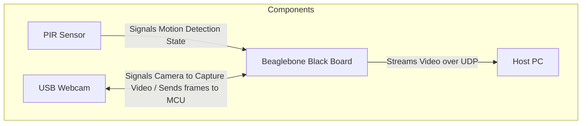
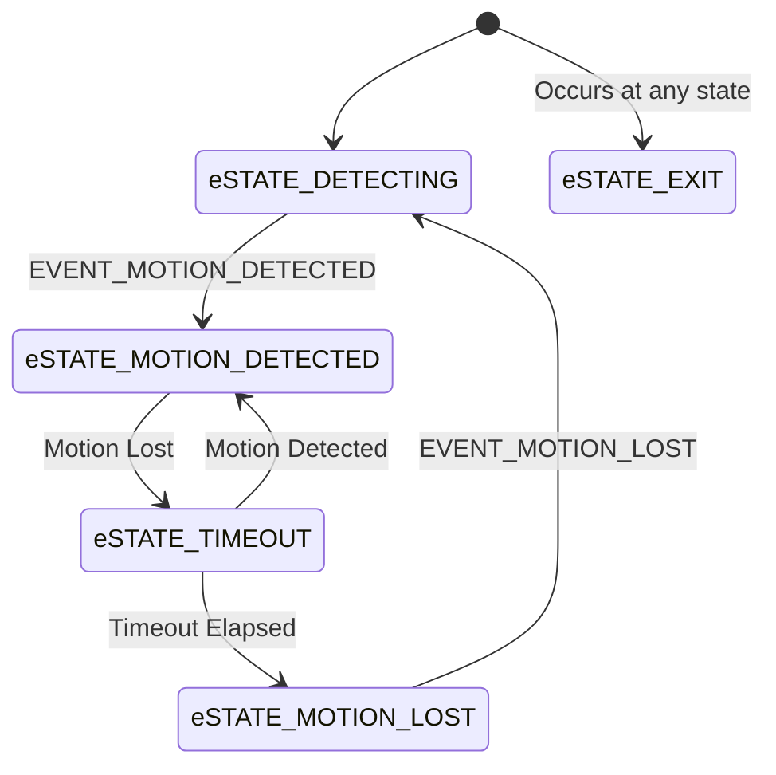
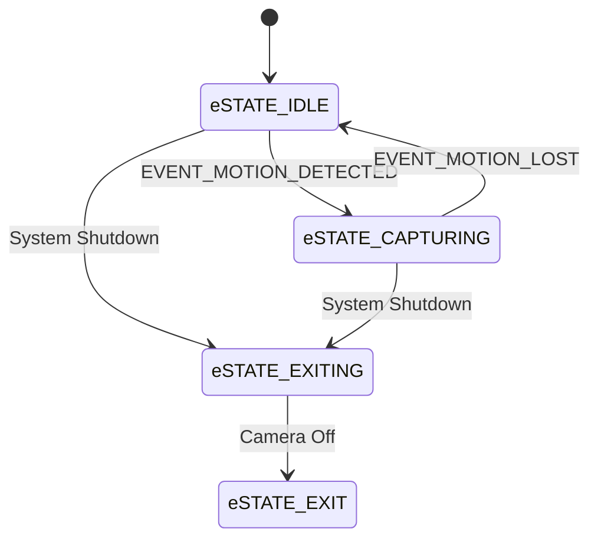
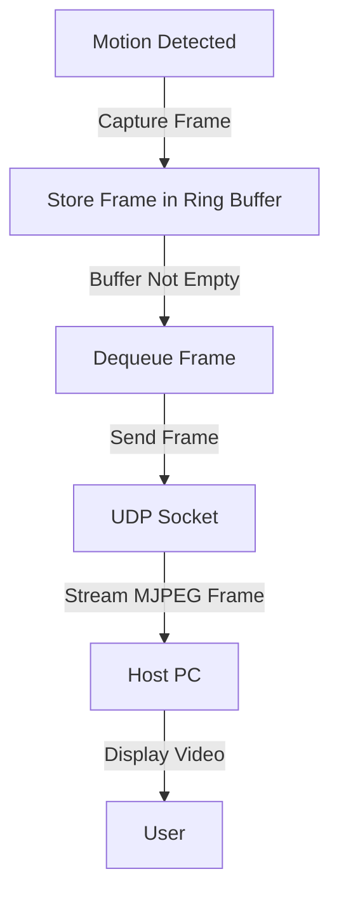

# Overview
This project aims to develop a motion-activated video streaming system using the Beaglebone Black. The primary goal is to create a reliable and efficient system that can detect motion using a PIR sensor, capture video using a USB webcam, and stream the video over UDP to a host PC. The motivation behind this project is to explore the capabilities of the Beaglebone Black in handling real-time video processing and streaming, as well as to gain hands-on experience with embedded Linux systems.

## Diagrams

The block diagram below illustrates the hardware components and their interactions:

### Block Diagram

### Components

#### PIR Sensor

[Seeed Technology Co., Ltd 101020060 PIR Motion Sensor](https://www.digikey.com/en/products/detail/seeed-technology-co-ltd/101020060/5487425?gclsrc=aw.ds&&utm_adgroup=&utm_source=google&utm_medium=cpc&utm_campaign=PMax%20Shopping_Product_Low%20ROAS%20Categories&utm_term=&utm_content=&utm_id=go_cmp-20243063506_adg-_ad-__dev-c_ext-_prd-5487425_sig-Cj0KCQiA_NC9BhCkARIsABSnSTa3Mft-hJZUGZTNmrAG3FNacbrdzt9ME92Uvu8GkAhfNYXAeGEyragaAp-EEALw_wcB&gad_source=1&gclid=Cj0KCQiA_NC9BhCkARIsABSnSTa3Mft-hJZUGZTNmrAG3FNacbrdzt9ME92Uvu8GkAhfNYXAeGEyragaAp-EEALw_wcB&gclsrc=aw.ds)

#### USB Webcam

[Logitech C920 HD Pro Webcam](https://www.logitech.com/en-gb/shop/p/c920-pro-hd-webcam.960-001055?srsltid=AfmBOoo3YtXhwlMyZrtsEMoOF_kX9aLfJYA74AU7-ibqodCde3_p4IT3)

#### Microcontroller

[BEAGLEBONE BLACK REV C AM3358BZCZ](https://www.digikey.com/en/products/detail/beagleboard/102110420/12719590?gclsrc=aw.ds&&utm_adgroup=&utm_source=google&utm_medium=cpc&utm_campaign=PMax%20Shopping_Product_Low%20ROAS%20Categories&utm_term=&utm_content=&utm_id=go_cmp-20243063506_adg-_ad-__dev-c_ext-_prd-12719590_sig-Cj0KCQiA_NC9BhCkARIsABSnSTYeo1pHZ67JWYJ_gNBy_bwLFCzQDgBF9kHc5uaEm_IufTvNotNPn6IaAuHvEALw_wcB&gad_source=1&gclid=Cj0KCQiA_NC9BhCkARIsABSnSTYeo1pHZ67JWYJ_gNBy_bwLFCzQDgBF9kHc5uaEm_IufTvNotNPn6IaAuHvEALw_wcB&gclsrc=aw.ds)

### Assembled Components

# Source Code and System Design

## Organization

The source code for this project is organized into several directories, each containing specific components of the system:

- **nvm**: Contains the code for non-volatile memory management, including `nvm.c` which handles initialization and task management for saving and streaming frames.
- **transcoder**: Contains the code for video transcoding, including `transcoder.c` which handles initialization and task management for processing frames.
- **camera**: Contains the code for video capturing, including `camera.c` which handles initialization and task management for capturing frames.
- **detection**: Contains the code for motion detecting, including `detection.c` which handles initialization and task management for detecting motion.
- **osal**: Contains the OS abstraction layer code.
- **utils**: Contains utility functions used across the project.
- **camera_cfg**: Contains configuration files for the camera.
- **image**: Contains image processing functions.

## Design

### Motion Detection and Video Capture

The detection and camera modules collaborate to detect motion and capture video frames, each operating as a state machine. The states are described below.

### State Transition Diagram

#### Motion Detection FSM

#### Camera FSM

### Video Streaming

The video stream uses MJPEG frames sent over UDP. Frames are stored in a ring buffer, and the streaming task dequeues and sends them via a UDP socket when the buffer is not empty.

### Design Constraints

#### Motion Sensor Output

The PIR sensors output a 3.3V signal when motion is detected. The signal timeout can be adjusted using a potentiometer: turning it clockwise increases the timeout, while turning it counter-clockwise decreases it. The minimum timeout is 2.5 seconds, and the maximum is approximately 250 seconds.

Empirical analysis has shown that the only consistent timeout across different sensors is the minimum timeout. For instance, some sensors may change from ~2.5 seconds to 20 seconds with a slight clockwise turn of the potentiometer. To ensure continuous motion detection without gaps, a software-based timeout algorithm was implemented.

#### UDP Packet Size

Sometimes, when using larger UDP packets (around 35k bytes), the video stream becomes choppy and skips frames. Reducing the packet size to 1k bytes improves the stream's smoothness, as the stream viewer parses each packet individually.